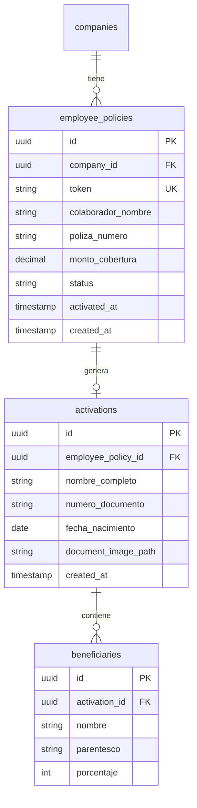
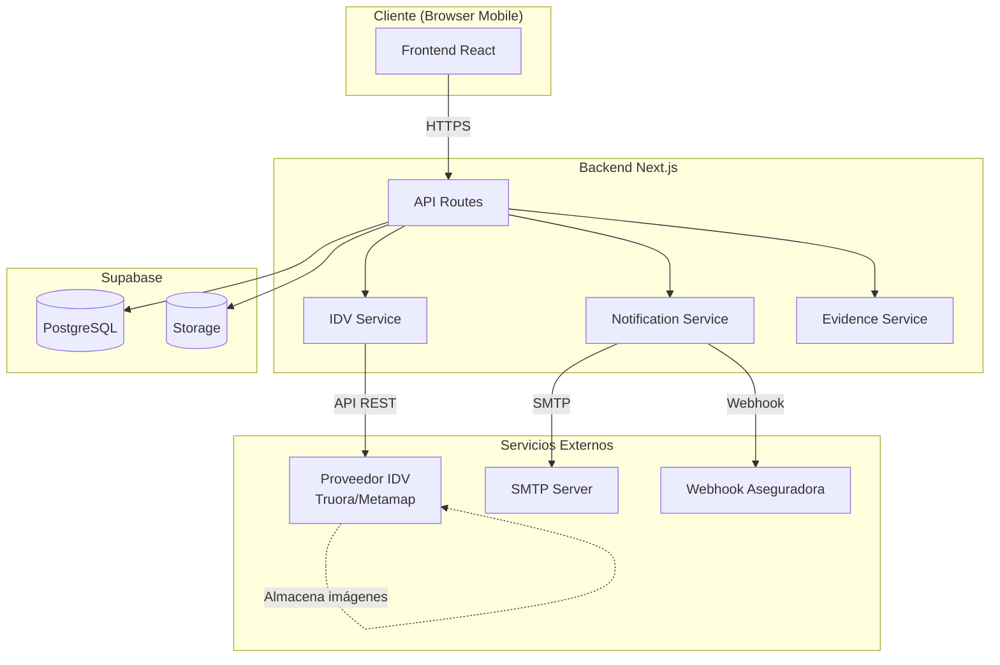
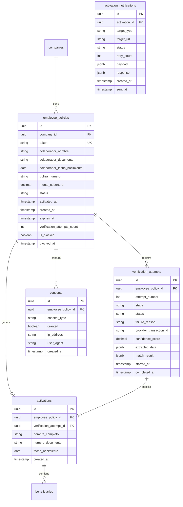
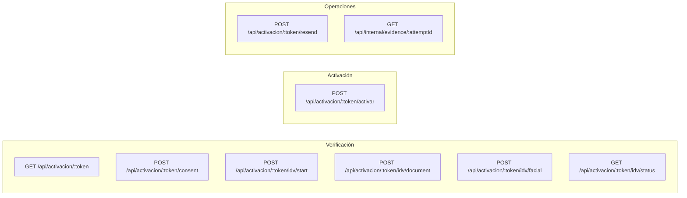
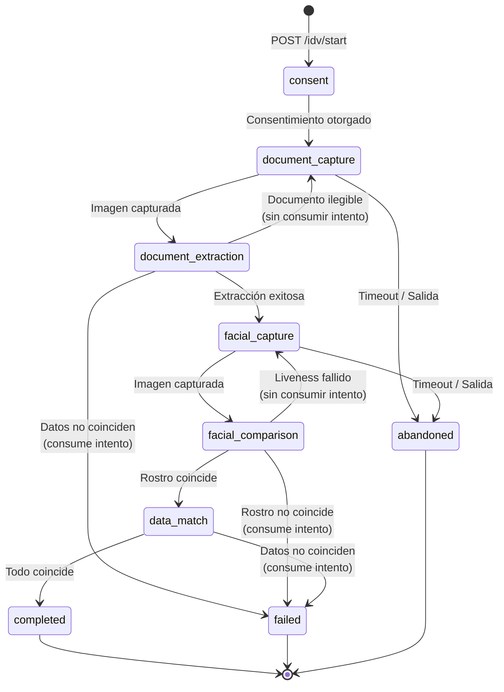
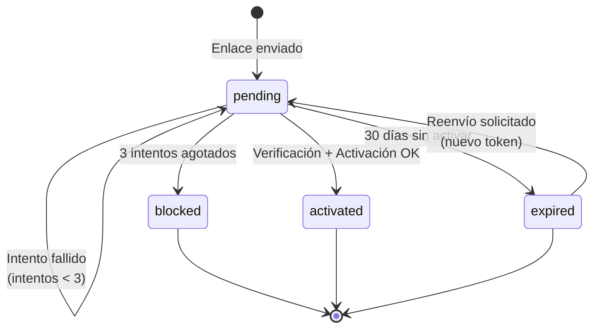
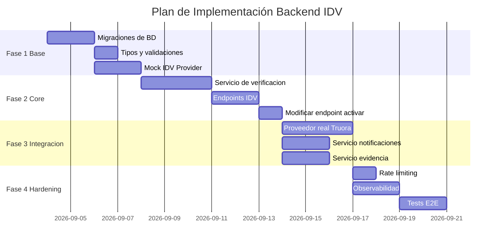

# RFC: Backend para Verificación de Identidad (IDV) en Flujo de Activación

| Campo                 | Valor                                                                 |
| --------------------- | --------------------------------------------------------------------- |
| **RFC ID**            | RFC-2026-001                                                          |
| **Título**            | Backend para Verificación de Identidad Biométrica en Activación       |
| **Autor(es)**         | Equipo de Ingeniería Respaldo                                         |
| **Fecha**             | 3 septiembre 2026                                                     |
| **Estado**            | Borrador                                                              |
| **PRD de referencia** | `prd_respaldo.md` — Verificación de identidad real en activación      |

---

## 1. Resumen Ejecutivo

Este RFC define la arquitectura backend para implementar verificación de identidad biométrica (IDV) en el flujo de activación de pólizas de seguros de vida colectiva. El sistema debe:

1. Gestionar el ciclo de vida de intentos de verificación (máximo 3 por miembro)
2. Integrar un proveedor externo de verificación biométrica facial
3. Contrastar datos extraídos del documento contra el padrón de elegibles
4. Registrar evidencia de cada intento con vinculación a la activación
5. Implementar expiración de enlaces de activación (30 días)
6. Notificar a la aseguradora sobre eventos de activación

---

## 2. Contexto Técnico Actual

### 2.1 Stack Tecnológico

- **Framework**: Next.js 14+ (App Router)
- **Base de datos**: Supabase (PostgreSQL)
- **Almacenamiento**: Supabase Storage
- **Email**: Nodemailer con SMTP
- **Runtime**: Node.js / Edge Functions

### 2.2 Modelo de Datos Actual



### 2.3 Endpoints Existentes

| Endpoint | Método | Función |
|----------|--------|---------|
| `/api/activacion/[token]` | GET | Resolver datos del enlace de activación |
| `/api/activacion/[token]/ocr` | POST | Subir documento y extraer datos (mock) |
| `/api/activacion/[token]/activar` | POST | Completar activación de póliza |

---

## 3. Arquitectura Propuesta

### 3.1 Diagrama de Arquitectura



### 3.2 Modelo de Datos Extendido



---

## 4. Especificación de Tablas

### 4.1 Migración: `employee_policies` (ALTER)

```sql
-- Agregar campos para IDV y expiración
ALTER TABLE employee_policies
ADD COLUMN colaborador_documento VARCHAR(20),
ADD COLUMN colaborador_fecha_nacimiento DATE,
ADD COLUMN expires_at TIMESTAMP WITH TIME ZONE,
ADD COLUMN verification_attempts_count INTEGER DEFAULT 0,
ADD COLUMN is_blocked BOOLEAN DEFAULT FALSE,
ADD COLUMN blocked_at TIMESTAMP WITH TIME ZONE;

-- Índice para consulta de expiración
CREATE INDEX idx_employee_policies_expires_at 
ON employee_policies(expires_at) 
WHERE status = 'pending';

-- Función para calcular expiración (30 días desde creación)
CREATE OR REPLACE FUNCTION set_expiration_date()
RETURNS TRIGGER AS $$
BEGIN
    NEW.expires_at := NEW.created_at + INTERVAL '30 days';
    RETURN NEW;
END;
$$ LANGUAGE plpgsql;

CREATE TRIGGER trigger_set_expiration
    BEFORE INSERT ON employee_policies
    FOR EACH ROW
    EXECUTE FUNCTION set_expiration_date();
```

### 4.2 Nueva Tabla: `verification_attempts`

```sql
CREATE TYPE verification_stage AS ENUM (
    'consent',
    'document_capture', 
    'document_extraction',
    'facial_capture',
    'facial_comparison',
    'data_match',
    'completed'
);

CREATE TYPE verification_status AS ENUM (
    'in_progress',
    'success',
    'failed',
    'abandoned',
    'provider_error'
);

CREATE TYPE failure_reason AS ENUM (
    'face_mismatch',
    'data_mismatch',
    'document_unreadable',
    'liveness_failed',
    'provider_unavailable',
    'timeout',
    'user_abandoned'
);

CREATE TABLE verification_attempts (
    id UUID PRIMARY KEY DEFAULT gen_random_uuid(),
    employee_policy_id UUID NOT NULL REFERENCES employee_policies(id),
    attempt_number INTEGER NOT NULL CHECK (attempt_number BETWEEN 1 AND 3),
    stage verification_stage NOT NULL DEFAULT 'consent',
    status verification_status NOT NULL DEFAULT 'in_progress',
    failure_reason failure_reason,
    provider_transaction_id VARCHAR(255),
    confidence_score DECIMAL(5,4),
    extracted_data JSONB,
    match_result JSONB,
    started_at TIMESTAMP WITH TIME ZONE DEFAULT NOW(),
    completed_at TIMESTAMP WITH TIME ZONE,
    
    UNIQUE(employee_policy_id, attempt_number)
);

CREATE INDEX idx_verification_attempts_policy 
ON verification_attempts(employee_policy_id);

CREATE INDEX idx_verification_attempts_status 
ON verification_attempts(status) 
WHERE status = 'in_progress';
```

### 4.3 Nueva Tabla: `consents`

```sql
CREATE TYPE consent_type AS ENUM (
    'biometric_data_processing',
    'policy_activation'
);

CREATE TABLE consents (
    id UUID PRIMARY KEY DEFAULT gen_random_uuid(),
    employee_policy_id UUID NOT NULL REFERENCES employee_policies(id),
    consent_type consent_type NOT NULL,
    granted BOOLEAN NOT NULL,
    ip_address INET,
    user_agent TEXT,
    created_at TIMESTAMP WITH TIME ZONE DEFAULT NOW(),
    
    UNIQUE(employee_policy_id, consent_type)
);

CREATE INDEX idx_consents_policy 
ON consents(employee_policy_id);
```

### 4.4 Nueva Tabla: `activation_notifications`

```sql
CREATE TYPE notification_target_type AS ENUM (
    'webhook',
    'email'
);

CREATE TYPE notification_status AS ENUM (
    'pending',
    'sent',
    'failed',
    'retrying'
);

CREATE TABLE activation_notifications (
    id UUID PRIMARY KEY DEFAULT gen_random_uuid(),
    activation_id UUID NOT NULL REFERENCES activations(id),
    target_type notification_target_type NOT NULL,
    target_url TEXT,
    status notification_status NOT NULL DEFAULT 'pending',
    retry_count INTEGER DEFAULT 0,
    max_retries INTEGER DEFAULT 3,
    payload JSONB NOT NULL,
    response JSONB,
    created_at TIMESTAMP WITH TIME ZONE DEFAULT NOW(),
    sent_at TIMESTAMP WITH TIME ZONE,
    next_retry_at TIMESTAMP WITH TIME ZONE
);

CREATE INDEX idx_notifications_pending 
ON activation_notifications(next_retry_at) 
WHERE status IN ('pending', 'retrying');
```

---

## 5. Especificación de API

### 5.1 Endpoints Nuevos



---

### 5.2 `GET /api/activacion/[token]`

Resuelve el enlace de activación y devuelve el estado actual.

**Response 200 (Success)**
```typescript
interface ActivacionLinkResponse {
  status: 'pending' | 'activated' | 'expired' | 'blocked'
  colaboradorNombre: string
  empresaNombre: string
  montoCobertura: number
  polizaNumero: string
  
  // Campos nuevos para IDV
  idv: {
    attemptsUsed: number
    maxAttempts: number
    isBlocked: boolean
    currentAttemptId: string | null
    currentStage: VerificationStage | null
    biometricConsentGiven: boolean
  }
  
  expiresAt: string // ISO 8601
  daysUntilExpiration: number
}
```

**Response 404 (Not Found)**
```typescript
{ error: 'Link no válido' }
```

**Response 410 (Gone)**
```typescript
{ error: 'Este enlace ha expirado', canRequestResend: true }
```

---

### 5.3 `POST /api/activacion/[token]/consent`

Registra el consentimiento del usuario.

**Request Body**
```typescript
interface ConsentRequest {
  consentType: 'biometric_data_processing' | 'policy_activation'
  granted: boolean
}
```

**Response 200 (Success)**
```typescript
interface ConsentResponse {
  consentId: string
  consentType: string
  granted: boolean
  timestamp: string
}
```

**Response 400 (Bad Request)**
```typescript
{ error: 'Tipo de consentimiento inválido' }
```

**Response 409 (Conflict)**
```typescript
{ error: 'El consentimiento ya fue registrado' }
```

---

### 5.4 `POST /api/activacion/[token]/idv/start`

Inicia un nuevo intento de verificación.

**Precondiciones**
- El enlace no debe estar expirado
- El usuario no debe estar bloqueado
- Debe existir consentimiento biométrico otorgado
- No debe haber un intento en progreso

**Response 201 (Created)**
```typescript
interface IDVStartResponse {
  attemptId: string
  attemptNumber: number
  attemptsRemaining: number
  providerConfig: {
    // Configuración específica del proveedor para el SDK del frontend
    baseUrl: string
    publicKey: string
    flowId: string
  }
}
```

**Response 403 (Forbidden)**
```typescript
{ error: 'Debe otorgar consentimiento biométrico antes de iniciar la verificación' }
```

**Response 409 (Conflict)**
```typescript
{ error: 'Ya existe una verificación en progreso', attemptId: string }
```

**Response 423 (Locked)**
```typescript
{ 
  error: 'Has agotado los intentos de verificación',
  contactInfo: {
    phone: string
    email: string
  }
}
```

---

### 5.5 `POST /api/activacion/[token]/idv/document`

Procesa la captura del documento de identidad.

**Request Body (multipart/form-data)**
```
file: Blob (imagen del documento)
attemptId: string
side: 'front' | 'back'
```

**Response 200 (Success)**
```typescript
interface DocumentResponse {
  extractedData: {
    numeroDocumento: string
    fechaNacimiento: string
    nombreCompleto: string
    documentType: 'DNI' | 'CE' | 'PASSPORT'
  }
  matchResult: {
    documentoMatches: boolean
    fechaNacimientoMatches: boolean
    allFieldsExtracted: boolean
  }
  canProceed: boolean
  stage: 'facial_capture' | 'document_capture'
  message?: string
}
```

**Response 400 (Bad Request)**
```typescript
{ 
  error: 'document_unreadable',
  message: 'No se pudo leer el documento. Asegúrate de que esté bien iluminado.',
  canRetryCapture: true  // No consume intento
}
```

**Response 422 (Unprocessable Entity)**
```typescript
{
  error: 'data_mismatch',
  message: 'Los datos del documento no coinciden con tu registro.',
  mismatchedFields: ['numeroDocumento' | 'fechaNacimiento'],
  attemptsRemaining: number
}
```

---

### 5.6 `POST /api/activacion/[token]/idv/facial`

Procesa la captura facial y ejecuta la comparación biométrica.

**Request Body (multipart/form-data)**
```
file: Blob (imagen facial)
attemptId: string
livenessData?: string (datos de liveness del SDK del proveedor)
```

**Response 200 (Success)**
```typescript
interface FacialResponse {
  verificationResult: 'success' | 'failed'
  confidenceScore: number
  stage: 'completed' | 'facial_capture'
  
  // Solo si success
  verifiedData?: {
    nombreCompleto: string
    numeroDocumento: string
    fechaNacimiento: string
  }
}
```

**Response 422 (Unprocessable Entity)**
```typescript
{
  error: 'face_mismatch',
  message: 'El rostro no coincide con la fotografía del documento.',
  confidenceScore: number,
  attemptsRemaining: number
}
```

**Response 422 (Liveness Failed)**
```typescript
{
  error: 'liveness_failed',
  message: 'No se pudo confirmar tu presencia física. Intenta de nuevo.',
  canRetryCapture: true
}
```

---

### 5.7 `GET /api/activacion/[token]/idv/status`

Consulta el estado actual de la verificación.

**Response 200**
```typescript
interface IDVStatusResponse {
  currentAttempt: {
    attemptId: string
    attemptNumber: number
    stage: VerificationStage
    status: VerificationStatus
    startedAt: string
    failureReason?: FailureReason
  } | null
  
  attemptsUsed: number
  maxAttempts: number
  isBlocked: boolean
  
  canProceedToActivation: boolean
  verifiedData?: {
    nombreCompleto: string
    numeroDocumento: string
    fechaNacimiento: string
  }
}
```

---

### 5.8 `POST /api/activacion/[token]/activar` (Modificado)

Completa la activación de la póliza.

**Precondiciones Nuevas**
- Debe existir una verificación exitosa (`verification_attempts.status = 'success'`)
- Debe existir consentimiento de póliza otorgado

**Request Body**
```typescript
interface ActivarRequest {
  beneficiaries: Beneficiary[]
  // Ya no se envía insuredData, se toma de la verificación
}
```

**Response 200 (Success)**
```typescript
interface ActivarResponse {
  polizaNumero: string
  activatedAt: string
  verificationId: string
  
  // Datos verificados
  insuredData: {
    nombreCompleto: string
    numeroDocumento: string
    fechaNacimiento: string
  }
}
```

**Response 403 (Forbidden)**
```typescript
{ error: 'Debe completar la verificación de identidad antes de activar' }
```

---

### 5.9 `POST /api/activacion/[token]/resend`

Solicita reenvío del enlace de activación (genera nuevo token).

**Request Body**
```typescript
interface ResendRequest {
  reason?: string
}
```

**Response 200 (Success)**
```typescript
{
  message: 'Se ha enviado un nuevo enlace a tu correo',
  newExpiresAt: string
}
```

**Response 429 (Too Many Requests)**
```typescript
{ error: 'Debes esperar antes de solicitar otro reenvío', retryAfter: number }
```

---

## 6. Integración con Proveedor IDV

### 6.1 Interfaz del Proveedor

```typescript
// lib/idv/provider.ts

export interface IDVProviderConfig {
  apiKey: string
  baseUrl: string
  webhookSecret: string
  confidenceThreshold: number
}

export interface DocumentExtractionResult {
  success: boolean
  transactionId: string
  extractedFields: {
    documentNumber?: string
    dateOfBirth?: string
    fullName?: string
    documentType?: string
    expirationDate?: string
  }
  allFieldsExtracted: boolean
  rawResponse: unknown
}

export interface FacialComparisonResult {
  success: boolean
  transactionId: string
  confidenceScore: number
  livenessDetected: boolean
  matchesDocument: boolean
  rawResponse: unknown
}

export interface IDVProvider {
  name: string
  
  // Extrae datos del documento
  extractDocument(
    image: Buffer,
    options?: { documentType?: string }
  ): Promise<DocumentExtractionResult>
  
  // Compara rostro contra documento
  compareFacial(
    facialImage: Buffer,
    documentImage: Buffer,
    options?: { livenessData?: string }
  ): Promise<FacialComparisonResult>
  
  // Recupera evidencia por transactionId
  getEvidence(transactionId: string): Promise<{
    documentImage: Buffer
    facialImage: Buffer
    metadata: Record<string, unknown>
  }>
  
  // Verifica salud del servicio
  healthCheck(): Promise<boolean>
}
```

### 6.2 Implementación Abstracta

```typescript
// lib/idv/providers/truora.ts (ejemplo)

export class TruoraProvider implements IDVProvider {
  name = 'truora'
  private config: IDVProviderConfig
  
  constructor(config: IDVProviderConfig) {
    this.config = config
  }
  
  async extractDocument(image: Buffer): Promise<DocumentExtractionResult> {
    const response = await fetch(`${this.config.baseUrl}/v1/documents/extract`, {
      method: 'POST',
      headers: {
        'Authorization': `Bearer ${this.config.apiKey}`,
        'Content-Type': 'application/json'
      },
      body: JSON.stringify({
        image: image.toString('base64'),
        country: 'PE',
        document_types: ['national_id', 'foreign_id', 'passport']
      })
    })
    
    // ... procesar respuesta
  }
  
  async compareFacial(
    facialImage: Buffer, 
    documentImage: Buffer
  ): Promise<FacialComparisonResult> {
    // ... implementación
  }
}
```

### 6.3 Factory Pattern

```typescript
// lib/idv/index.ts

import type { IDVProvider } from './provider'
import { TruoraProvider } from './providers/truora'
import { MetamapProvider } from './providers/metamap'
import { MockIDVProvider } from './providers/mock'

export function createIDVProvider(): IDVProvider {
  const providerName = process.env.IDV_PROVIDER || 'mock'
  
  switch (providerName) {
    case 'truora':
      return new TruoraProvider({
        apiKey: process.env.TRUORA_API_KEY!,
        baseUrl: process.env.TRUORA_BASE_URL!,
        webhookSecret: process.env.TRUORA_WEBHOOK_SECRET!,
        confidenceThreshold: parseFloat(process.env.IDV_CONFIDENCE_THRESHOLD || '0.85')
      })
    
    case 'metamap':
      return new MetamapProvider({
        // ...config
      })
    
    default:
      console.warn('⚠️ Using mock IDV provider')
      return new MockIDVProvider()
  }
}

export const idvProvider = createIDVProvider()
```

---

## 7. Flujos de Estado

### 7.1 Máquina de Estados: Intento de Verificación



### 7.2 Máquina de Estados: Miembro Elegible



---

## 8. Servicio de Verificación

### 8.1 Clase Principal

```typescript
// lib/idv/verification-service.ts

import { createServerSupabaseClient } from '@/lib/supabase/server'
import { idvProvider } from './index'
import type { IDVProvider, FacialComparisonResult } from './provider'

interface StartVerificationResult {
  attemptId: string
  attemptNumber: number
  attemptsRemaining: number
}

interface ProcessDocumentResult {
  success: boolean
  extractedData?: ExtractedData
  matchResult?: MatchResult
  canProceed: boolean
  error?: string
}

export class VerificationService {
  private supabase = createServerSupabaseClient()
  private provider: IDVProvider
  private confidenceThreshold: number
  
  constructor() {
    this.provider = idvProvider
    this.confidenceThreshold = parseFloat(
      process.env.IDV_CONFIDENCE_THRESHOLD || '0.85'
    )
  }
  
  /**
   * Inicia un nuevo intento de verificación
   */
  async startVerification(policyId: string): Promise<StartVerificationResult> {
    // 1. Verificar que no esté bloqueado
    const { data: policy } = await this.supabase
      .from('employee_policies')
      .select('verification_attempts_count, is_blocked, expires_at')
      .eq('id', policyId)
      .single()
    
    if (policy.is_blocked) {
      throw new VerificationError('BLOCKED', 'Has agotado los intentos de verificación')
    }
    
    if (new Date(policy.expires_at) < new Date()) {
      throw new VerificationError('EXPIRED', 'Este enlace ha expirado')
    }
    
    // 2. Verificar consentimiento biométrico
    const { data: consent } = await this.supabase
      .from('consents')
      .select('granted')
      .eq('employee_policy_id', policyId)
      .eq('consent_type', 'biometric_data_processing')
      .single()
    
    if (!consent?.granted) {
      throw new VerificationError(
        'CONSENT_REQUIRED', 
        'Debe otorgar consentimiento biométrico'
      )
    }
    
    // 3. Verificar que no haya intento en progreso
    const { data: inProgress } = await this.supabase
      .from('verification_attempts')
      .select('id')
      .eq('employee_policy_id', policyId)
      .eq('status', 'in_progress')
      .single()
    
    if (inProgress) {
      throw new VerificationError(
        'ATTEMPT_IN_PROGRESS', 
        'Ya existe una verificación en progreso',
        { attemptId: inProgress.id }
      )
    }
    
    // 4. Crear nuevo intento
    const attemptNumber = policy.verification_attempts_count + 1
    
    const { data: attempt } = await this.supabase
      .from('verification_attempts')
      .insert({
        employee_policy_id: policyId,
        attempt_number: attemptNumber,
        stage: 'document_capture',
        status: 'in_progress'
      })
      .select('id')
      .single()
    
    // 5. Incrementar contador
    await this.supabase
      .from('employee_policies')
      .update({ verification_attempts_count: attemptNumber })
      .eq('id', policyId)
    
    return {
      attemptId: attempt.id,
      attemptNumber,
      attemptsRemaining: 3 - attemptNumber
    }
  }
  
  /**
   * Procesa el documento capturado
   */
  async processDocument(
    attemptId: string,
    documentImage: Buffer,
    expectedData: { documento: string, fechaNacimiento: string }
  ): Promise<ProcessDocumentResult> {
    // 1. Extraer datos del documento
    const extraction = await this.provider.extractDocument(documentImage)
    
    if (!extraction.success || !extraction.allFieldsExtracted) {
      // No consumir intento si el documento es ilegible
      await this.updateAttempt(attemptId, {
        stage: 'document_capture',
        extracted_data: extraction.rawResponse
      })
      
      return {
        success: false,
        canProceed: false,
        error: 'document_unreadable'
      }
    }
    
    // 2. Contrastar con datos del padrón
    const documentoMatches = 
      extraction.extractedFields.documentNumber === expectedData.documento
    const fechaMatches = 
      extraction.extractedFields.dateOfBirth === expectedData.fechaNacimiento
    
    const matchResult = {
      documentoMatches,
      fechaNacimientoMatches: fechaMatches,
      allFieldsExtracted: true
    }
    
    if (!documentoMatches || !fechaMatches) {
      // Consumir intento si los datos no coinciden
      await this.failAttempt(attemptId, 'data_mismatch', {
        extracted_data: extraction.extractedFields,
        match_result: matchResult,
        provider_transaction_id: extraction.transactionId
      })
      
      return {
        success: false,
        extractedData: extraction.extractedFields,
        matchResult,
        canProceed: false,
        error: 'data_mismatch'
      }
    }
    
    // 3. Avanzar a captura facial
    await this.updateAttempt(attemptId, {
      stage: 'facial_capture',
      extracted_data: extraction.extractedFields,
      match_result: matchResult,
      provider_transaction_id: extraction.transactionId
    })
    
    return {
      success: true,
      extractedData: extraction.extractedFields,
      matchResult,
      canProceed: true
    }
  }
  
  /**
   * Procesa la captura facial y ejecuta comparación
   */
  async processFacial(
    attemptId: string,
    facialImage: Buffer,
    documentImage: Buffer
  ): Promise<FacialComparisonResult & { canProceed: boolean }> {
    // 1. Ejecutar comparación facial
    const comparison = await this.provider.compareFacial(
      facialImage, 
      documentImage
    )
    
    // 2. Verificar liveness
    if (!comparison.livenessDetected) {
      // No consumir intento si falla liveness
      return {
        ...comparison,
        canProceed: false
      }
    }
    
    // 3. Verificar coincidencia facial
    if (comparison.confidenceScore < this.confidenceThreshold) {
      await this.failAttempt(attemptId, 'face_mismatch', {
        confidence_score: comparison.confidenceScore,
        provider_transaction_id: comparison.transactionId
      })
      
      return {
        ...comparison,
        canProceed: false
      }
    }
    
    // 4. Éxito: marcar como completado
    await this.updateAttempt(attemptId, {
      stage: 'completed',
      status: 'success',
      confidence_score: comparison.confidenceScore,
      provider_transaction_id: comparison.transactionId,
      completed_at: new Date().toISOString()
    })
    
    return {
      ...comparison,
      canProceed: true
    }
  }
  
  /**
   * Marca un intento como fallido y verifica bloqueo
   */
  private async failAttempt(
    attemptId: string, 
    reason: string,
    data: Record<string, unknown>
  ): Promise<void> {
    // 1. Actualizar intento
    const { data: attempt } = await this.supabase
      .from('verification_attempts')
      .update({
        status: 'failed',
        failure_reason: reason,
        completed_at: new Date().toISOString(),
        ...data
      })
      .eq('id', attemptId)
      .select('employee_policy_id, attempt_number')
      .single()
    
    // 2. Verificar si debe bloquearse
    if (attempt.attempt_number >= 3) {
      await this.supabase
        .from('employee_policies')
        .update({ 
          is_blocked: true, 
          blocked_at: new Date().toISOString() 
        })
        .eq('id', attempt.employee_policy_id)
      
      // 3. Notificar bloqueo a la aseguradora
      await this.notifyBlock(attempt.employee_policy_id)
    }
  }
  
  private async updateAttempt(
    attemptId: string, 
    data: Record<string, unknown>
  ): Promise<void> {
    await this.supabase
      .from('verification_attempts')
      .update(data)
      .eq('id', attemptId)
  }
  
  private async notifyBlock(policyId: string): Promise<void> {
    // Implementar notificación a aseguradora
  }
}

export class VerificationError extends Error {
  code: string
  details?: Record<string, unknown>
  
  constructor(
    code: string, 
    message: string, 
    details?: Record<string, unknown>
  ) {
    super(message)
    this.code = code
    this.details = details
  }
}
```

---

## 9. Servicio de Notificaciones

### 9.1 Webhook a Aseguradora

```typescript
// lib/notifications/activation-notifier.ts

interface ActivationPayload {
  event: 'activation.completed' | 'verification.blocked'
  timestamp: string
  data: {
    policyNumber: string
    memberDocument: string
    memberName: string
    companyId: string
    
    // Solo para activation.completed
    activatedAt?: string
    verificationId?: string
    beneficiaries?: {
      name: string
      relationship: string
      percentage: number
    }[]
    
    // Solo para verification.blocked
    blockedAt?: string
    attemptsCount?: number
    lastFailureReason?: string
  }
}

export class ActivationNotifier {
  private supabase = createServerSupabaseClient()
  
  /**
   * Notifica activación exitosa a la aseguradora
   */
  async notifyActivation(activationId: string): Promise<void> {
    const { data: activation } = await this.supabase
      .from('activations')
      .select(`
        *,
        beneficiaries(*),
        employee_policies(
          *,
          companies(nombre, webhook_url, notification_email)
        ),
        verification_attempts(id, provider_transaction_id)
      `)
      .eq('id', activationId)
      .single()
    
    const policy = activation.employee_policies
    const company = policy.companies
    
    const payload: ActivationPayload = {
      event: 'activation.completed',
      timestamp: new Date().toISOString(),
      data: {
        policyNumber: policy.poliza_numero,
        memberDocument: activation.numero_documento,
        memberName: activation.nombre_completo,
        companyId: policy.company_id,
        activatedAt: policy.activated_at,
        verificationId: activation.verification_attempt_id,
        beneficiaries: activation.beneficiaries.map(b => ({
          name: b.nombre,
          relationship: b.parentesco,
          percentage: b.porcentaje
        }))
      }
    }
    
    // Crear registro de notificación
    const { data: notification } = await this.supabase
      .from('activation_notifications')
      .insert({
        activation_id: activationId,
        target_type: 'webhook',
        target_url: company.webhook_url,
        payload
      })
      .select('id')
      .single()
    
    // Enviar webhook
    await this.sendWebhook(notification.id, company.webhook_url, payload)
  }
  
  /**
   * Envía webhook con reintentos
   */
  private async sendWebhook(
    notificationId: string,
    url: string,
    payload: ActivationPayload
  ): Promise<void> {
    const signature = this.signPayload(payload)
    
    try {
      const response = await fetch(url, {
        method: 'POST',
        headers: {
          'Content-Type': 'application/json',
          'X-Respaldo-Signature': signature,
          'X-Respaldo-Event': payload.event
        },
        body: JSON.stringify(payload),
        signal: AbortSignal.timeout(10000) // 10s timeout
      })
      
      await this.supabase
        .from('activation_notifications')
        .update({
          status: response.ok ? 'sent' : 'failed',
          sent_at: new Date().toISOString(),
          response: {
            status: response.status,
            body: await response.text().catch(() => null)
          }
        })
        .eq('id', notificationId)
      
      if (!response.ok) {
        await this.scheduleRetry(notificationId)
      }
    } catch (error) {
      await this.supabase
        .from('activation_notifications')
        .update({
          status: 'failed',
          response: { error: error.message }
        })
        .eq('id', notificationId)
      
      await this.scheduleRetry(notificationId)
    }
  }
  
  /**
   * Programa reintento con backoff exponencial
   */
  private async scheduleRetry(notificationId: string): Promise<void> {
    const { data } = await this.supabase
      .from('activation_notifications')
      .select('retry_count, max_retries')
      .eq('id', notificationId)
      .single()
    
    if (data.retry_count >= data.max_retries) {
      // Enviar alerta interna
      console.error(`Notification ${notificationId} failed after max retries`)
      return
    }
    
    const backoffMs = Math.pow(2, data.retry_count) * 60000 // 1m, 2m, 4m
    const nextRetry = new Date(Date.now() + backoffMs)
    
    await this.supabase
      .from('activation_notifications')
      .update({
        status: 'retrying',
        retry_count: data.retry_count + 1,
        next_retry_at: nextRetry.toISOString()
      })
      .eq('id', notificationId)
  }
  
  private signPayload(payload: ActivationPayload): string {
    const secret = process.env.WEBHOOK_SIGNING_SECRET!
    const hmac = crypto.createHmac('sha256', secret)
    hmac.update(JSON.stringify(payload))
    return hmac.digest('hex')
  }
}
```

---

## 10. Servicio de Evidencia

### 10.1 Registro y Recuperación

```typescript
// lib/evidence/evidence-service.ts

interface EvidenceRecord {
  attemptId: string
  policyNumber: string
  memberDocument: string
  timestamp: string
  stage: string
  status: string
  failureReason?: string
  providerTransactionId: string
  confidenceScore?: number
  extractedData?: Record<string, unknown>
}

export class EvidenceService {
  private supabase = createServerSupabaseClient()
  private idvProvider: IDVProvider
  
  /**
   * Recupera evidencia completa de un intento
   * (Solo accesible por equipo interno)
   */
  async getEvidence(attemptId: string): Promise<{
    record: EvidenceRecord
    images?: {
      document: Buffer
      facial: Buffer
    }
  }> {
    const { data: attempt } = await this.supabase
      .from('verification_attempts')
      .select(`
        *,
        employee_policies(poliza_numero, colaborador_documento)
      `)
      .eq('id', attemptId)
      .single()
    
    const record: EvidenceRecord = {
      attemptId: attempt.id,
      policyNumber: attempt.employee_policies.poliza_numero,
      memberDocument: attempt.employee_policies.colaborador_documento,
      timestamp: attempt.started_at,
      stage: attempt.stage,
      status: attempt.status,
      failureReason: attempt.failure_reason,
      providerTransactionId: attempt.provider_transaction_id,
      confidenceScore: attempt.confidence_score,
      extractedData: attempt.extracted_data
    }
    
    // Recuperar imágenes del proveedor si es necesario
    let images
    if (attempt.provider_transaction_id) {
      try {
        images = await this.idvProvider.getEvidence(
          attempt.provider_transaction_id
        )
      } catch (error) {
        console.error('Failed to retrieve images from provider:', error)
      }
    }
    
    return { record, images }
  }
  
  /**
   * Lista intentos de verificación para una póliza
   */
  async listAttempts(policyId: string): Promise<EvidenceRecord[]> {
    const { data: attempts } = await this.supabase
      .from('verification_attempts')
      .select('*')
      .eq('employee_policy_id', policyId)
      .order('attempt_number', { ascending: true })
    
    return attempts.map(a => ({
      attemptId: a.id,
      policyNumber: '',
      memberDocument: '',
      timestamp: a.started_at,
      stage: a.stage,
      status: a.status,
      failureReason: a.failure_reason,
      providerTransactionId: a.provider_transaction_id,
      confidenceScore: a.confidence_score
    }))
  }
}
```

---

## 11. Manejo de Errores

### 11.1 Códigos de Error

| Código | HTTP | Descripción | Acción del Cliente |
|--------|------|-------------|-------------------|
| `LINK_NOT_FOUND` | 404 | Token inválido | Mostrar error, no reintentar |
| `LINK_EXPIRED` | 410 | Enlace expirado | Mostrar opción de reenvío |
| `ALREADY_ACTIVATED` | 409 | Póliza ya activada | Mostrar confirmación previa |
| `BLOCKED` | 423 | 3 intentos agotados | Mostrar contacto aseguradora |
| `CONSENT_REQUIRED` | 403 | Falta consentimiento | Redirigir a consentimiento |
| `ATTEMPT_IN_PROGRESS` | 409 | Intento activo | Continuar intento existente |
| `DOCUMENT_UNREADABLE` | 400 | Doc no legible | Permitir recaptura |
| `DATA_MISMATCH` | 422 | Datos no coinciden | Mostrar error, consumió intento |
| `FACE_MISMATCH` | 422 | Rostro no coincide | Mostrar error, consumió intento |
| `LIVENESS_FAILED` | 422 | Liveness falló | Permitir recaptura |
| `PROVIDER_UNAVAILABLE` | 503 | Proveedor caído | Reintentar después |
| `INTERNAL_ERROR` | 500 | Error interno | Reintentar después |

### 11.2 Respuesta de Error Estándar

```typescript
interface ErrorResponse {
  error: string          // Código de error
  message: string        // Mensaje legible
  details?: {
    attemptsRemaining?: number
    canRetryCapture?: boolean
    contactInfo?: {
      phone: string
      email: string
    }
    retryAfter?: number  // segundos
  }
}
```

---

## 12. Configuración y Variables de Entorno

```bash
# .env.local

# === Proveedor IDV ===
IDV_PROVIDER=truora                    # truora | metamap | mock
IDV_CONFIDENCE_THRESHOLD=0.85          # Umbral de coincidencia facial

# Truora
TRUORA_API_KEY=xxx
TRUORA_BASE_URL=https://api.truora.com
TRUORA_WEBHOOK_SECRET=xxx

# Metamap (alternativo)
METAMAP_CLIENT_ID=xxx
METAMAP_CLIENT_SECRET=xxx
METAMAP_FLOW_ID=xxx

# === Notificaciones ===
WEBHOOK_SIGNING_SECRET=xxx             # Para firmar webhooks salientes

# === Supabase (existente) ===
NEXT_PUBLIC_SUPABASE_URL=xxx
SUPABASE_SERVICE_ROLE_KEY=xxx

# === SMTP (existente) ===
SMTP_HOST=xxx
SMTP_PORT=587
SMTP_USER=xxx
SMTP_PASSWORD=xxx
```

---

## 13. Consideraciones de Seguridad

### 13.1 Protección de Datos

1. **No almacenamiento de imágenes**: Las imágenes del documento y facial **no se almacenan** en Supabase Storage. Solo se conserva el `provider_transaction_id` para recuperar evidencia del proveedor cuando sea necesario.

2. **Datos sensibles en tránsito**: Todas las comunicaciones usan HTTPS/TLS 1.3.

3. **Acceso a evidencia**: Solo el equipo interno de Respaldo puede consultar evidencia. No hay API pública para partners en V1.

### 13.2 Prevención de Abuso

```typescript
// Middleware de rate limiting por token
const rateLimiter = new Map<string, { count: number, resetAt: number }>()

export function checkRateLimit(token: string): boolean {
  const now = Date.now()
  const limit = rateLimiter.get(token)
  
  if (!limit || now > limit.resetAt) {
    rateLimiter.set(token, { count: 1, resetAt: now + 60000 })
    return true
  }
  
  if (limit.count >= 10) { // 10 requests por minuto
    return false
  }
  
  limit.count++
  return true
}
```

### 13.3 Validación de Entrada

```typescript
// Validación con Zod
import { z } from 'zod'

export const consentSchema = z.object({
  consentType: z.enum(['biometric_data_processing', 'policy_activation']),
  granted: z.boolean()
})

export const beneficiarySchema = z.object({
  nombre: z.string().min(2).max(100),
  parentesco: z.enum(['conyuge', 'hijo', 'padre', 'madre', 'otro']),
  porcentaje: z.number().min(1).max(100)
})

export const activarSchema = z.object({
  beneficiaries: z.array(beneficiarySchema).min(1).max(3)
}).refine(
  data => data.beneficiaries.reduce((sum, b) => sum + b.porcentaje, 0) === 100,
  { message: 'Los porcentajes deben sumar 100%' }
)
```

---

## 14. Observabilidad

### 14.1 Métricas a Instrumentar

| Métrica | Tipo | Labels |
|---------|------|--------|
| `idv_attempts_total` | Counter | `status`, `failure_reason` |
| `idv_attempt_duration_seconds` | Histogram | `stage` |
| `idv_provider_latency_seconds` | Histogram | `operation`, `provider` |
| `idv_provider_errors_total` | Counter | `provider`, `error_type` |
| `activations_total` | Counter | `company_id` |
| `webhook_delivery_total` | Counter | `status`, `company_id` |

### 14.2 Logs Estructurados

```typescript
// Ejemplo de log de intento
logger.info('verification_attempt_completed', {
  attemptId: 'xxx',
  policyId: 'xxx',
  companyId: 'xxx',
  attemptNumber: 2,
  stage: 'facial_comparison',
  status: 'failed',
  failureReason: 'face_mismatch',
  confidenceScore: 0.72,
  durationMs: 8500,
  providerLatencyMs: 3200
})
```

### 14.3 Alertas

| Condición | Severidad | Acción |
|-----------|-----------|--------|
| Tasa de error proveedor > 5% en 5m | Critical | Página + Slack |
| Latencia p95 > 30s | Warning | Slack |
| Webhook delivery failure rate > 10% | Warning | Slack |
| Member blocked | Info | Log only |

---

## 15. Plan de Migración

### 15.1 Fases



### 15.2 Feature Flag

```typescript
// lib/feature-flags.ts

export const IDV_ENABLED = process.env.FEATURE_IDV_ENABLED === 'true'

// En el endpoint
if (!IDV_ENABLED) {
  // Flujo legacy sin verificación
  return NextResponse.json({ legacy: true })
}
```

### 15.3 Rollback

1. Desactivar feature flag `FEATURE_IDV_ENABLED=false`
2. Las activaciones volverán al flujo sin verificación
3. Los datos de verificación permanecen en BD para auditoría

---

## 16. Testing

### 16.1 Casos de Prueba Unitarios

```typescript
describe('VerificationService', () => {
  describe('startVerification', () => {
    it('should create attempt when conditions are met')
    it('should throw BLOCKED when 3 attempts used')
    it('should throw EXPIRED when link expired')
    it('should throw CONSENT_REQUIRED when no biometric consent')
    it('should throw ATTEMPT_IN_PROGRESS when existing attempt')
  })
  
  describe('processDocument', () => {
    it('should extract and match document data')
    it('should return error without consuming attempt on unreadable')
    it('should consume attempt on data mismatch')
  })
  
  describe('processFacial', () => {
    it('should pass when confidence above threshold')
    it('should fail without consuming attempt on liveness failure')
    it('should consume attempt on face mismatch')
    it('should block member on 3rd failed attempt')
  })
})
```

### 16.2 Set de Pruebas Adversariales

| Escenario | Input | Resultado Esperado |
|-----------|-------|-------------------|
| Foto de foto | Imagen de pantalla con documento | Liveness: FAIL |
| Documento de otra persona | Doc válido, rostro diferente | Face match: FAIL |
| Documento adulterado | Doc con foto pegada | Face match: FAIL |
| Datos manipulados | Doc con número alterado | Data match: FAIL |
| Replay attack | Video pregrabado | Liveness: FAIL |

---

## 17. Decisiones Técnicas Pendientes

| Decisión | Opciones | Criterio | Owner |
|----------|----------|----------|-------|
| Proveedor IDV | Truora vs Metamap | Costo, latencia, precisión | Producto + Ing |
| Umbral de confianza | 0.80 - 0.90 | Tasa de falsos positivos vs UX | Producto |
| Liveness: activo vs pasivo | Gestos vs análisis de video | Fricción vs seguridad | Producto |
| Fallo de proveedor consume intento | Sí vs No | UX vs abuso | Producto |

---

## 18. Glosario

| Término | Definición |
|---------|------------|
| **IDV** | Identity Verification - Verificación de identidad |
| **Liveness** | Detección de presencia física real (anti-spoofing) |
| **Padrón** | Lista de miembros elegibles provista por la aseguradora |
| **Intento** | Una sesión de verificación que puede tener múltiples capturas |
| **Captura** | Toma individual de imagen (documento o facial) |

---

## 19. Referencias

- PRD: `prd_respaldo.md`
- Truora API: https://docs.truora.com
- Metamap API: https://docs.metamap.com
- Supabase: https://supabase.com/docs
- Ley 29733 (Perú): Protección de Datos Personales

---

## 20. Changelog

| Versión | Fecha | Cambios |
|---------|-------|---------|
| 0.1 | 2026-09-03 | Borrador inicial |
